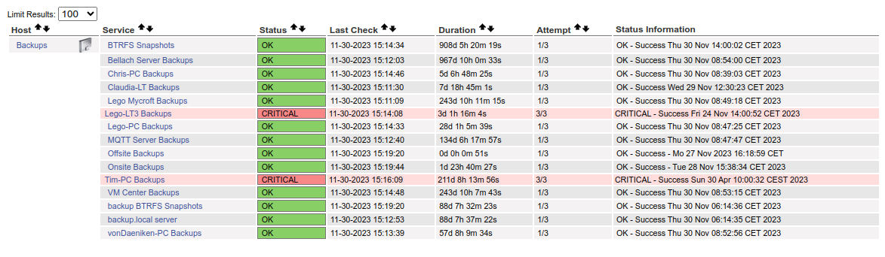

# check_backup
Nagios check.  
On this server all backs create a one line status file in a status directory.\
This check looks at that result,  Nagios displays the result.\
For a green Ok status the file must contain **Success** and not be older than ẁarn_level`

Below we see all backups were successful but 2 machines are in a critical state as the backups occured longer than parameter `crit_level`

## Nagios cfg example
~~~
 define service {
     use generic-service
     host_name Backups
     service_description VM Center Backups
     check_command check_backup!debian10-vm.local!2880!4320
     notifications_enabled   1
     }

 define service {
     use generic-service
     host_name Backups
     service_description Onsite Backups
     check_command check_backup!onsite!10080!20160 # Warn after 1 weeks. Critical after 2 weeks
     notifications_enabled   1
     }

 define service {
     use generic-service
     host_name Backups
     service_description Offsite Backups
     check_command check_backup!offsite!30240!60480 # Warn after 3 weeks. Critical after 6 weeks
     notifications_enabled   1
     }

~~~
### Break down
check_command check_backup!onsite!10080!20160 # Warn after 1 weeks. Critical after 2 weeks

Where:\
onsite = file to check\
10080 = warn_level\
20160 = crit_level

